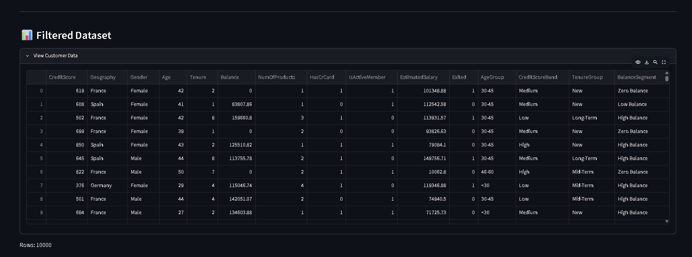

# 🏦 Customer Segmentation & Churn Analytics

## 📌 Project Overview

Customer churn is one of the biggest challenges faced by retail banks. Losing existing customers reduces customer lifetime value, increases acquisition costs, and affects long-term revenue growth.

This project analyzes customer churn patterns using customer segmentation techniques and visual analytics. The goal is to identify high-risk customer groups and provide actionable insights for customer retention strategies.

---

## 🎯 Problem Statement

Banks possess large amounts of customer data but often struggle to answer critical questions such as:

* Which customer segments are most likely to churn?
* How does churn vary across countries and demographics?
* Are high-value customers leaving the bank?
* How does customer engagement impact churn?

This project addresses these challenges through segmentation-driven analytics and interactive dashboarding.

---

## 🎯 Project Objectives

### Primary Objectives

* Measure overall customer churn rate
* Analyze churn across customer segments
* Compare churn behavior across European regions

### Secondary Objectives

* Analyze high-value customer churn
* Evaluate tenure and engagement patterns
* Support strategic decision-making using data insights

---

## 📊 Dataset Information

The dataset contains 10,000 bank customers and 15 analytical features.

| Column          | Description              |
| --------------- | ------------------------ |
| CreditScore     | Customer credit score    |
| Geography       | France, Germany, Spain   |
| Gender          | Male / Female            |
| Age             | Customer age             |
| Tenure          | Years with bank          |
| Balance         | Account balance          |
| NumOfProducts   | Number of products       |
| HasCrCard       | Credit card ownership    |
| IsActiveMember  | Customer activity status |
| EstimatedSalary | Estimated annual salary  |
| Exited          | Churn indicator          |
| AgeGroup        | Derived age segment      |
| CreditScoreBand | Derived credit segment   |
| TenureGroup     | Derived tenure segment   |
| BalanceSegment  | Derived balance segment  |

---

## 🛠 Technologies Used

* Python
* Pandas
* NumPy
* Plotly
* Streamlit
* Scikit-Learn
* Jupyter Notebook
* Git & GitHub

---

## 📂 Project Structure

```text
Customer-Churn-Analytics
│
├── dashboard
│   └── app.py
│
├── data
│   └── processed
│
├── notebooks
│   ├── 01_data_cleaning.ipynb
│   ├── 02_feature_engineering.ipynb
│   ├── 03_churn_analysis.ipynb
│   └── 04_logistic_regression.ipynb
│
├── screenshots
│
├── README.md
└── requirements.txt
```

---

## 🔍 Data Preparation

### Data Cleaning

* Removed unnecessary columns
* Checked missing values
* Verified duplicate records
* Validated data consistency

### Feature Engineering

Created new segmentation features:

* AgeGroup
* CreditScoreBand
* TenureGroup
* BalanceSegment

---

## 📈 Exploratory Data Analysis

### Overall Churn Rate

* Total Customers: 10,000
* Churned Customers: 2,037
* Churn Rate: 20.37%

### Segmentation Analysis

* Geography-wise churn
* Age-wise churn
* Tenure-wise churn
* Credit score churn
* Gender-wise churn
* Active vs inactive customer churn
* Balance segment churn

---

## 🤖 Machine Learning Model

### Logistic Regression

Steps performed:

1. Feature Selection
2. One-Hot Encoding
3. Train-Test Split (80:20)
4. Logistic Regression Training
5. Model Evaluation

### Model Performance

* Accuracy: 81.4%

Confusion Matrix:

```text
[[1540   67]
 [ 305   88]]
```

Classification Report:

```text
Precision (Churn Class): 0.57
Recall (Churn Class): 0.22
F1 Score: 0.32
```

---

## 📊 Streamlit Dashboard Features

### Interactive Filters

* Geography Filter
* Gender Filter

### KPI Cards

* Total Customers
* Churned Customers
* Retained Customers
* Churn Rate

### Visualizations

* Customer Distribution Pie Chart
* Geography-wise Churn Rate
* Age-wise Churn Rate
* Tenure-wise Churn Rate
* Credit Score Band Churn
* Gender-wise Churn Rate
* Active vs Inactive Member Churn
* Balance Segment Churn
* High Value Customer Analysis

---

## 📷 Dashboard Screenshots

### Dashboard Home


### Dataset View



### Geography Churn Analysis


### Age-wise Churn Analysis


### Tenure-wise Churn Analysis


---

## 💡 Key Insights

* Overall churn rate is 20.37%.
* Customer churn varies significantly across countries.
* Inactive customers are more likely to churn.
* Certain age groups show higher churn rates.
* High-value customers contribute substantially to churn risk.
* Customer engagement plays an important role in retention.

---

## 🚀 Running the Project

Install dependencies:

```bash
pip install -r requirements.txt
```

Run Streamlit dashboard:

```bash
streamlit run dashboard/app.py
```

---

## 👨‍💻 Author

**Steve Joshua T**

Customer Segmentation & Churn Analytics Internship Project
