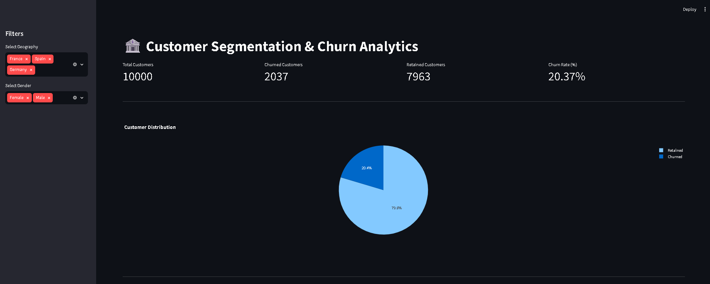
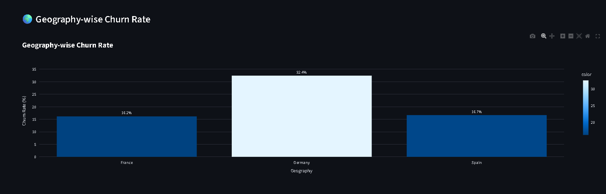
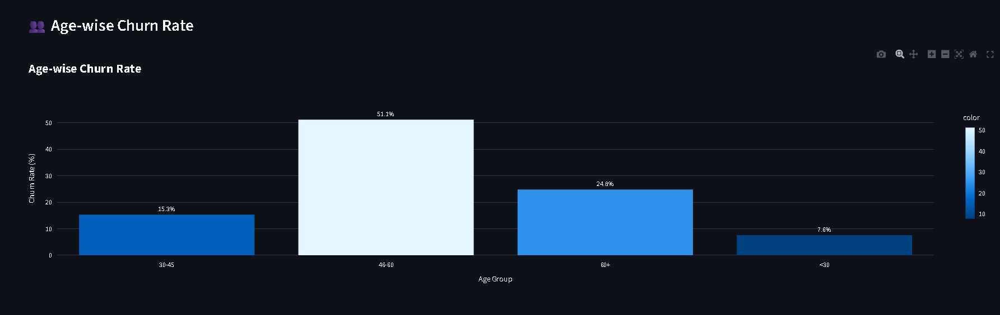
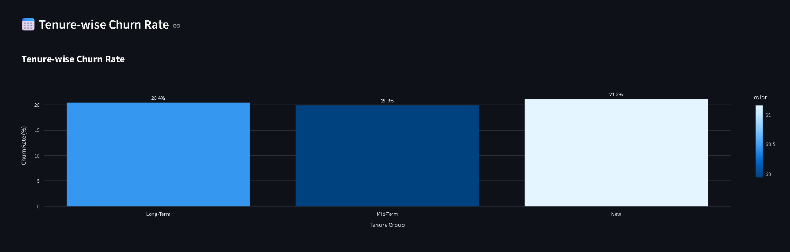

# 🏦 Customer Segmentation & Churn Analytics

## 📌 Project Overview

Customer churn is one of the biggest challenges faced by banks. This project analyzes customer churn patterns using customer segmentation, exploratory data analysis, machine learning, and interactive dashboarding.

The goal is to identify high-risk customer groups and provide actionable insights for customer retention strategies.

---

## 🎯 Objectives

### Primary Objectives

* Measure overall customer churn rate
* Identify churn distribution across customer segments
* Compare churn behavior across European regions

### Secondary Objectives

* Analyze high-value customer churn
* Evaluate customer engagement and tenure patterns
* Support strategic decision-making using data analytics

---

## 📊 Dataset Description

The dataset contains 10,000 customer records from a European bank.

| Feature         | Description                       |
| --------------- | --------------------------------- |
| CreditScore     | Customer creditworthiness         |
| Geography       | France, Germany, Spain            |
| Gender          | Male/Female                       |
| Age             | Customer age                      |
| Tenure          | Years with bank                   |
| Balance         | Account balance                   |
| NumOfProducts   | Number of products owned          |
| HasCrCard       | Credit card ownership             |
| IsActiveMember  | Activity status                   |
| EstimatedSalary | Annual salary                     |
| Exited          | Churn Indicator (Target Variable) |

---

## 🛠 Technologies Used

* Python
* Pandas
* NumPy
* Matplotlib
* Plotly
* Streamlit
* Scikit-Learn
* Jupyter Notebook

---

## 🔄 Project Workflow

### 1. Data Cleaning

* Loaded banking dataset
* Removed unnecessary fields
* Checked data quality
* Validated target variable

### 2. Feature Engineering

Created customer segments:

* AgeGroup
* CreditScoreBand
* TenureGroup
* BalanceSegment

### 3. Exploratory Data Analysis

Analyzed:

* Geography-wise churn
* Age-wise churn
* Gender-wise churn
* Tenure-wise churn
* Credit score churn
* Active vs inactive customer churn
* High-value customer churn

### 4. Machine Learning

Implemented Logistic Regression model.

Steps:

* Train-Test Split
* One-Hot Encoding
* Model Training
* Prediction
* Evaluation

Model Accuracy:

**81.4%**

---

## 📈 Dashboard Features

The Streamlit dashboard includes:

* KPI Cards
* Churn Distribution Pie Chart
* Customer Dataset Viewer
* Geography-wise Churn Analysis
* Age-wise Churn Analysis
* Tenure-wise Churn Analysis
* Credit Score Analysis
* Gender-wise Analysis
* Active vs Inactive Member Analysis
* Balance Segment Analysis
* High Value Customer Analysis

---

## 📷 Dashboard Screenshots

### Dashboard Home



### Geography Analysis



### Age Analysis



### Tenure Analysis



---

## 📂 Project Structure

```text
Customer-Churn-Analytics
│
├── dashboard
│   └── app.py
│
├── data
│
├── notebooks
│
├── reports
│   ├── Executive_Summary.md
│   ├── Research_Paper.md
│   └── Final_Report.md
│
├── screenshots
│
├── README.md
```

## ▶️ How to Run

Install dependencies:

```bash
pip install -r requirements.txt
```

Run Streamlit dashboard:

```bash
streamlit run dashboard/app.py
```

---

## 📌 Key Findings

* Overall churn rate is approximately 20%.
* Germany has the highest churn rate.
* Inactive customers are more likely to churn.
* Customers aged 46–60 show higher churn tendencies.
* High-balance customers contribute significant revenue risk.

---

## 🚀 Future Improvements

* Deploy dashboard online
* Add advanced machine learning models
* Integrate real-time banking data
* Build customer churn prediction API

---

## 👨‍💻 Author

Steve Joshua T

Customer Segmentation & Churn Analytics Project

Unified Mentor Internship
